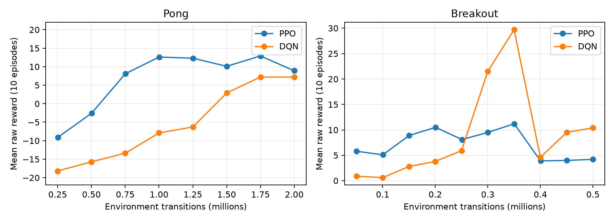
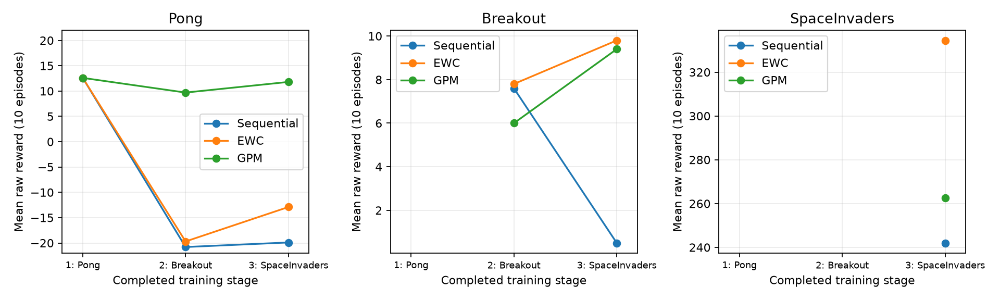

# Atari 参考结果

这里汇总 [Atari 强化学习教程](../biai/atari/atari.ipynb)使用的 12 个参考案例，展示单任务学习、联合训练和顺序学习中的得分变化。图表和数据随仓库提供，无需重新训练即可查看。

每个评估点都是 10 个完整游戏回合的平均得分，使用未经裁剪的原始奖励。Pong、Breakout 和 Space Invaders 的计分尺度不同，下文分别比较各游戏的表现。

## 训练步数与比较条件

训练步数指所有环境合计的交互次数，不是模拟器帧数。每个游戏使用 8 个并行环境，表中的步数已包含它们的采样总量。

| 案例 | PPO | DQN |
| --- | --- | --- |
| Pong 单任务 | 200 万步 | 200 万步 |
| Breakout 单任务 | 50 万步 | 50 万步 |
| 联合训练 | 三个游戏共 150 万步 | 三个游戏共 150 万步 |
| 顺序训练、EWC、GPM | Pong 1,000,448 步，之后每个游戏 50 万步 | 每个游戏 50 万步 |

顺序训练均按 Pong → Breakout → Space Invaders 进行。表中只统计主训练循环的交互量；每次 GPM 顺序实验还额外采集 98,304 条交互数据，用于估计需要保留的特征方向。

联合训练中，每个游戏实际分到约 50 万步，Pong 单任务则训练了 200 万步。因此，两者的得分差距同时受到训练方式和交互量的影响。若要在相同交互次数下比较，可运行 [README 中的 14 案例对照](../README.md)；本页展示的是上表这组参考实验。

## 单任务学习曲线

横轴是交互步数，纵轴是评估均分。圆点表示实际评估，连线展示它们之间的变化。Pong 记录了 8 个评估点，Breakout 记录了 10 个；点的数量不同，横轴覆盖的训练步数也不同。

Pong 中，PPO 和 DQN 的得分都随训练总体提高。Breakout 的变化更不稳定：DQN 在 35 万步时达到 29.7 分，40 万步时降到 4.6 分，最终为 10.4 分。PPO 也从约 35 万步时的 11.2 分降到了最终的 4.2 分。最终模型不一定是训练过程中得分最高的模型。

## 顺序训练与遗忘

横轴表示刚完成哪个游戏的训练。每个面板对应一个游戏，尚未学习的游戏留空。图中的 Sequential 是普通顺序训练。

三种 PPO 方法学完 Pong 时都是 12.6 分。完成全部任务后，普通顺序训练降到 −19.9 分，EWC 为 −12.9 分，GPM 为 11.8 分。这次实验中，GPM 较好地保留了 Pong 的表现。

在最后一个游戏 Space Invaders 上，EWC 得到 334.5 分，GPM 为 262.5 分。EWC 学习新游戏的得分较高，GPM 则保留了更多 Pong 能力，两种方法在这次运行中各有得失。

[DQN 的阶段曲线](figures/dqn_continual.png)中，三种方法刚学完 Pong 时均为 −15.0 分，起点就比较弱。Breakout 上，GPM 从 5.6 分降到 1.7 分，普通顺序训练从 22.0 分降到 3.7 分。GPM 虽然下降较少，但刚学完和最终的得分都更低。遗忘幅度需要与任务实际学到的水平一起看。

## 最终模型的得分

下表评估的是各次训练结束时的模型。单任务行的 Pong 和 Breakout 来自两个分别训练的模型；这份参考数据未包含 Space Invaders 的单任务结果，表中以“—”表示。

| 算法 | 配置 | Pong | Breakout | Space Invaders |
| --- | --- | ---: | ---: | ---: |
| PPO | 单任务 | 8.9 | 4.2 | — |
| PPO | 联合 | -16.0 | 6.7 | 287.5 |
| PPO | 普通顺序 | -19.9 | 0.5 | 242.0 |
| PPO | 顺序 + EWC | -12.9 | 9.8 | 334.5 |
| PPO | 顺序 + GPM | 11.8 | 9.4 | 262.5 |
| DQN | 单任务 | 7.2 | 10.4 | — |
| DQN | 联合 | -15.5 | 4.2 | 337.0 |
| DQN | 普通顺序 | -21.0 | 3.7 | 273.5 |
| DQN | 顺序 + EWC | -21.0 | 0.1 | 426.5 |
| DQN | 顺序 + GPM | -19.3 | 1.7 | 216.5 |

每个案例使用训练种子 `0`。表格反映这些配置在本次训练中的表现；要了解方法间的差异是否稳定，需要换用其他种子重复训练。

## 查看逐回合数据

[reference_results.json](reference_results.json) 保存了绘图和表格使用的数据：

- `models`：最终评估均分和逐回合得分。
- `learning_curves`：训练过程中的评估结果。
- `continual`：顺序训练的阶段得分矩阵和各阶段的逐回合得分。
- `configurations`：对应的训练设置。

例如，DQN 在 Breakout 上的最终均分为 10.4，但这 10 个回合的得分从 1 到 27 不等。逐回合数据能展示均分背后的波动。

教程动图截取一个评估回合的前 10 秒，便于观察智能体的动作。它展示的是回合片段，表格中的均分则来自完整回合。
